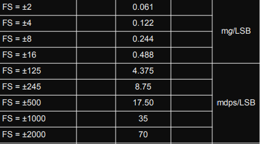
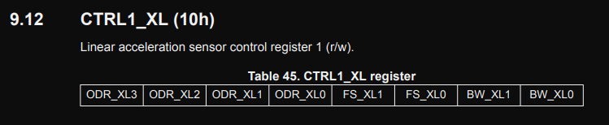
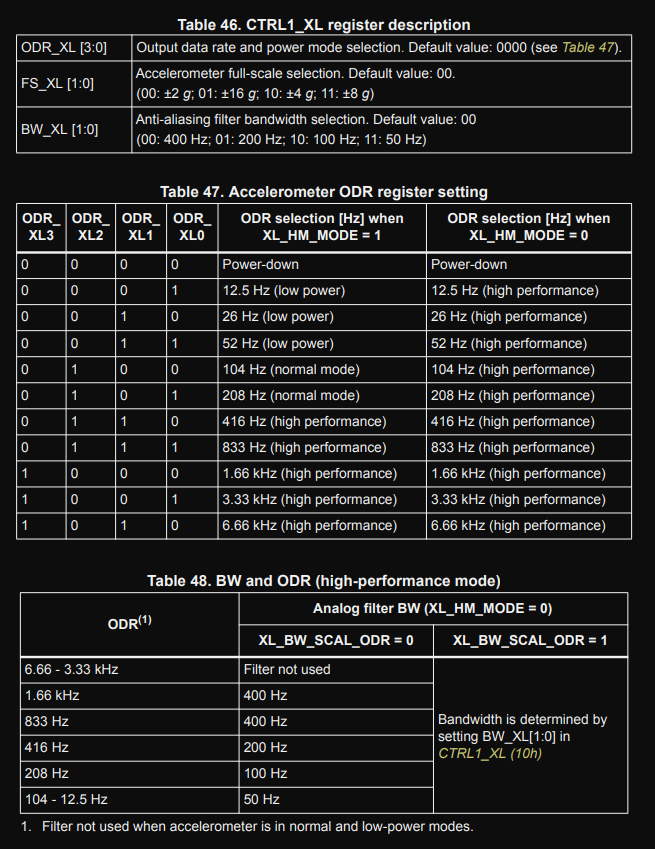
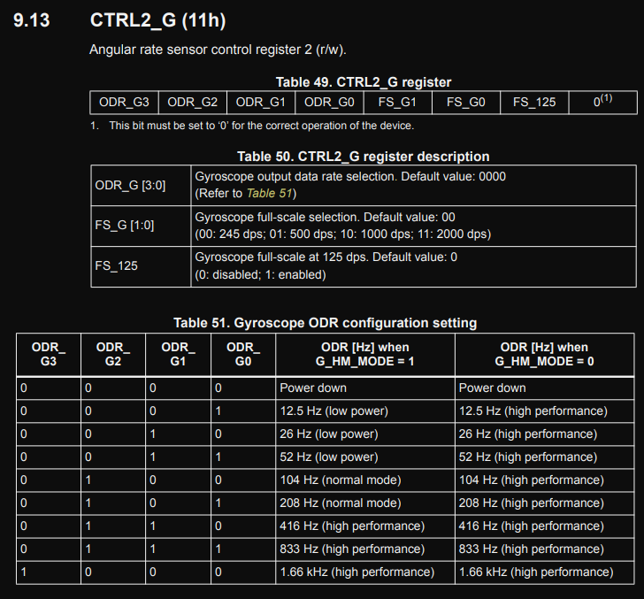
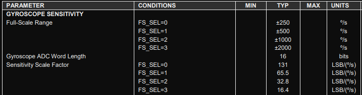
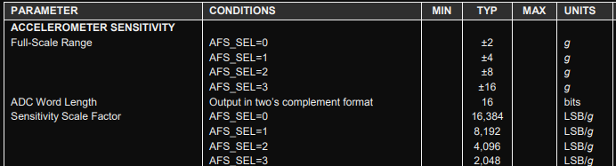
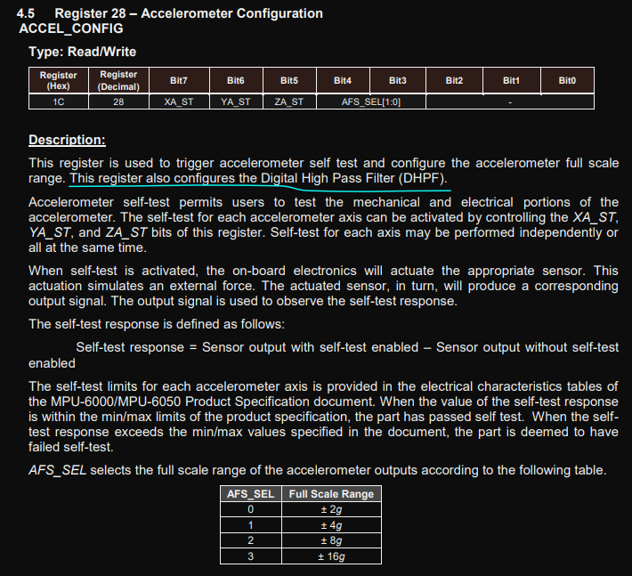
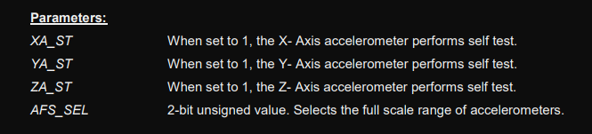
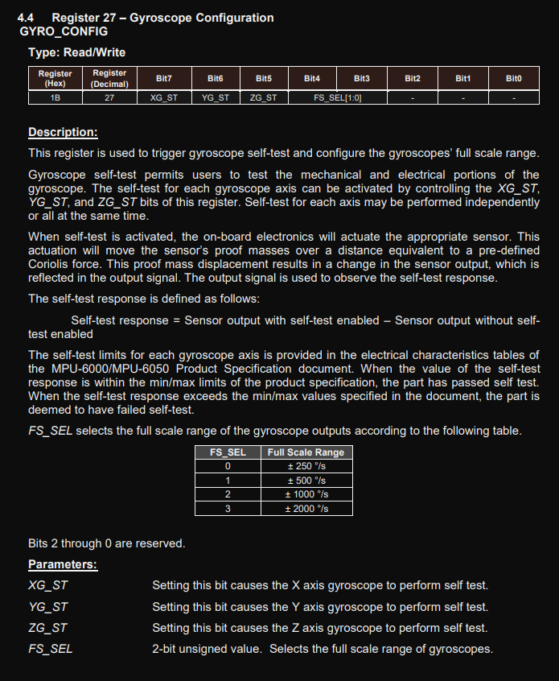
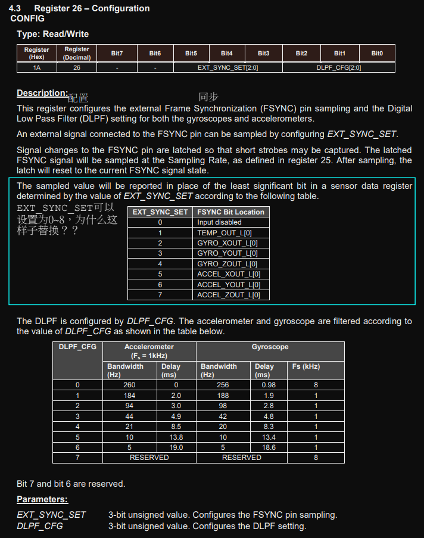

# 1. LSM6DS3

## 1.1. LSB

## 1.2. Range

### 1.2.1. CTRL1_XL (10h)

### 1.2.2. CTRL2_G (11h)

# 2. MPU6050

## 2.1. Gyroscope Specifications

## 2.2. Accelerometer Specifications

## 2.3. ACCEL_CONFIG (1Ch)

## 

## 

## 2.4. GYRO_CONFIG (1Bh)

## 

## 2.5. CONFIG (1Ah)

