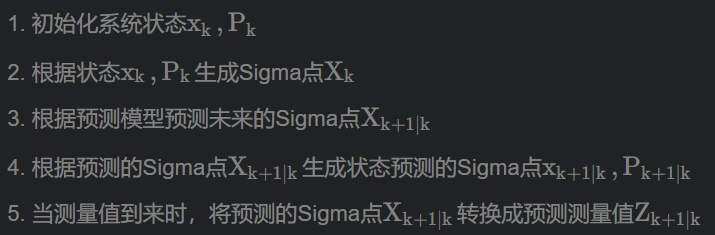

# .* 和 * 的区别

在 MATLAB 中，`.*` 和 `*` 是两种不同的运算符，主要区别在于它们的运算方式：

### **.`*`（逐元素乘法）**：

- 用于两个数组（矩阵或向量）之间的逐元素乘法。
- 例如，如果 `A` 和 `B` 是同样大小的矩阵，则 `A .* B` 会对每个对应元素进行相乘。

### **`*`（矩阵乘法）**：

- 用于矩阵乘法运算。
- 矩阵乘法的规则是，左侧矩阵的列数必须等于右侧矩阵的行数。结果是一个新的矩阵，其行数来自左侧矩阵，列数来自右侧矩阵。

### 示例：

- 如果 `A = [1, 2; 3, 4]` 和 `B = [5, 6; 7, 8]`：
  - `A .* B` 的结果是 ` [1*5, 2*6; 3*7, 4*8] = [5, 12; 21, 32]`。
  - `A * B` 的结果是 ` [1*5 + 2*7, 1*6 + 2*8; 3*5 + 4*7, 3*6 + 4*8] = [19, 22; 43, 50]`。

因此，在你的函数中使用 `.*` 是为了确保每个元素之间进行逐元素的乘法运算。

详细解释一下 X(:,k)  = gfun(X(:,k-1), k-1)


# 这行代码 `X(:,k) = gfun(X(:,k-1), k-1)` 是MATLAB中的一个赋值操作,用于更新矩阵X的第k列。让我详细解释一下:

### 代码解析

1. `X`: 这是一个矩阵变量。

1. `(:,k)`: 这是矩阵X的索引方式,其中冒号(`:`)表示沿着所有行遍历,而`k`指定从第k列开始。

1. `=`: 赋值符号,表示将右侧的值赋给左侧。

1. `gfun(...)`: 这是一个自定义函数,用于计算新的状态值。

1. `(X(:,k-1), k-1)`: 这是传递给gfun函数的参数。

### 步骤解释

1. 首先,取X矩阵的前一列(X(:,k-1))作为当前状态。

1. 然后,调用gfun函数,传入两个参数:
   - 第一个参数是X(:,k-1),即当前状态。
   - 第二个参数是k-1,可能是时间步或其他标识符。

1. gfun函数计算新的状态值。

1. 最后,gfun函数返回的结果被赋值给X(:,k),即更新X矩阵的第k列。

### 关键点

1. 这是一种常见的状态转换方法,通常用于滤波器、预测器等。

1. gfun函数内部可能包含了复杂的状态转换逻辑,如线性、非线性和周期性项。

1. 这种方法允许每次迭代都基于前一次迭代的结果进行更新。

1. k的值会随着循环次数的增加而改变,从而实现状态的连续更新。

### 应用场景

这种代码片段经常出现在需要进行状态预测或滤波的系统中,例如:

- Kalman滤波器
- 预测控制
- 时间序列分析
- 信号处理

总之,这行代码实现了一个状态更新过程,通过调用自定义函数gfun来计算新的状态值,并将其应用到矩阵X的下一列。这种方法允许建模复杂的系统动态,特别是在需要考虑历史依赖关系时。


# UKF的核心公式主要包括以下几部分:

### 状态预测

1. 获得2n+1个Sigma点及其权值:

```
Xσ = {x̄, x̄ ± √(L + λ)χ_i}
w_m = {1/(2(L+λ)), i=1,...,2n}
w_c = {1/(2(L+λ)) + (1-α^2 + β), i=n+1,...,2n+1}
```

其中 x̄是当前状态估计值, χ_i 是协方差矩阵的第i列。

2. 将Sigma点通过状态转移函数f(x,t)预测得到:

```
Xσ_f = f(Xσ, t)
```

3. 计算预测均值和协方差:

```
x̄_f = Σ w_m * x̄_f
P_f = Σ w_c * (x̄_f - x̄_f)(x̄_f - x̄_f)'
```

### 观测预测

4. 使用UT变换生成新的Sigma点集:

```
Xaugsigma = {x̄_f, x̄_f ± √((L+λ)P_f)χ_i'}
```

5. 将Sigma点代入观测函数h(x,t)计算预测观测值:

```
Zσ_p = h(Xaugsigma, t)
```

6. 计算预测观测均值和协方差:

```
z̄_p = Σ w_m * z̄_p
P_zz = Σ w_c * (z̄_p - z̄_p)(z̄_p - z̄_p)'
```

### 状态更新

7. 计算卡尔曼增益:

```
K = P_xz * P_zz^-1
```

8. 更新状态和协方差:

```
x̂ = x̄_f + K(z - z̄_p)
P = P_f - K * P_zz * K'
```

这些公式是UKF的核心部分,描述了状态预测、观测预测以及状态更新的过程。UKF通过使用Sigma点来近似非线性系统的概率分布,从而解决了传统卡尔曼滤波中高斯线性假设的问题。

Citations:
[1] https://blog.csdn.net/gangdanerya/article/details/105215446
[2] https://blog.csdn.net/weixin_44670677/article/details/132098161
[3] https://cloud.baidu.com/article/3115595
[4] https://www.cnblogs.com/yrm1160029237/p/10161663.html
[5] http://www.360doc.com/content/23/0918/08/99071_1096914483.shtml
[6] https://blog.shipengx.com/archives/cfd8b171.html
[7] https://docs.pingcode.com/ask/ask-ask/199950.html
[8] http://www.360doc.com/content/22/1002/13/40892371_1050221664.shtml
[9] https://www.ncnynl.com/archives/201904/2956.html
[10] https://nlpr.ia.ac.cn/2007papers/gnkw/nk31.pdf


# 在 MATLAB 中，引号 `'` 表示矩阵的转置。具体来说，在这一行代码中：

```matlab
Ppred=Ppred+Wc(k)*(Xsigmapre(:,k)-Xpred)*(Xsigmapre(:,k)-Xpred)';
```

`(Xsigmapre(:,k) - Xpred)'` 计算的是向量 `Xsigmapre(:,k) - Xpred` 的转置，这样做的目的是为了生成一个矩阵，以便后续进行矩阵乘法。

### 具体作用：

1. **向量与转置**：`(Xsigmapre(:,k) - Xpred)` 是一个 \(L \times 1\) 的列向量。通过转置，这个列向量变成了一个 \(1 \times L\) 的行向量。

2. **矩阵乘法**：
   - 进行乘法时，`(Xsigmapre(:,k) - Xpred)` 与其转置的结果会形成一个 \(L \times L\) 的矩阵。
   - 这个矩阵表示的是第 \(k\) 个 sigma 点与预测均值之间差异的协方差贡献。

通过引入转置操作，最终能够计算出协方差矩阵，从而在无迹卡尔曼滤波中更新和预测状态的不确定性。


# UT变换(unscented transform)是一种用于处理非线性系统的数学工具。以下是关于UT变换的主要内容:

### 定义和原理

UT变换是用固定数量的参数去近似一个高斯分布。它的实现原理如下:

1. 在原先分布中按某一规则取一些点,使这些点的均值为协方差状态分布与原状态分布的均值和协方差相等。

2. 将这些点代入非线性函数中,相应得到非线性函数值点集。

3. 通过这些点集可求取变换的均值和协方差。

### 与EKF的区别

1. EKF是对高度复杂非线性系统模型函数进行泰勒展开,对展开式进行一阶线性截断处理。

2. UKF(基于UT变换的卡尔曼滤波器)直接使用系统的非线性模型,不需对非线性系统线性化。

3. UKF能获得精确到三阶矩均值和协方差,具有更高的滤波精度。

### 应用

UT变换主要用于:

1. 在卡尔曼滤波器的非线性版本(无迹卡尔曼滤波器UKF)中估计其平均值及共变异数在非线性投影下的值。

2. Riemann-Stieltjes最佳控制的计算框架。

3. 水下、陆上及空中导航等领域。

### 优点

1. 不需要推导雅可比矩阵,计算简单。

2. 可以应用于不可微分或无法线性化的函数。

3. 可以捕捉到分布的三阶矩信息。

总之,UT变换是一种有效的方法,用于处理非线性系统中的状态估计问题,特别是在需要准确描述分布特性的情况下。

Citations:
[1] https://www.cnblogs.com/long5683/p/14091520.html
[2] https://www.bilibili.com/read/cv23418273/
[3] https://zh.wikipedia.org/zh-hans/%E6%97%A0%E8%BF%B9%E5%8F%98%E6%8D%A2
[4] https://blog.csdn.net/l2014010671/article/details/93305871
[5] https://blog.csdn.net/qq_44154915/article/details/136909458
[6] https://zhidao.baidu.com/question/186374114.html
[7] http://www.aas.net.cn/fileZDHXB/journal/article/zdhxb/2014/5/PDF/2014-5-838.pdf
[8] https://chaoli.club/index.php/10410
[9] https://www.cnblogs.com/sbb-first-blog/p/16653826.html
[10] https://cloud.baidu.com/article/3115595


# UKF算法步骤

### UKF的算法步骤如下

> 1. 初始化系统状态x k , P k x_k,P_kxk,Pk
> 2. 根据状态x k , P k x_k,P_kxk,Pk生成Sigma点X k X_kXk
> 3. 根据预测模型预测未来的Sigma点X k + 1 ∣ k X_{k+1|k}Xk+1∣k
> 4. 根据预测的Sigma点X k + 1 ∣ k X_{k+1|k}Xk+1∣k生成状态预测的Sigma点x k + 1 ∣ k , P k + 1 ∣ k x_{k+1|k},P_{k+1|k}xk+1∣k,Pk+1∣k
> 5. 当测量值到来时，将预测的Sigma点X k + 1 ∣ k X_{k+1|k}Xk+1∣k转换成预测测量值Z k + 1 ∣ k Z_{k+1|k}Zk+1∣k
> 6. 根据预测测量值Z k + 1 ∣ k Z_{k+1|k}Zk+1∣k与真实测量值z k + 1 z_{k+1}zk+1的差值更新得到系统状态x k + 1 ∣ k + 1 , P k + 1 ∣ k + 1 x_{k+1|k+1},P_{k+1|k+1}xk+1∣k+1,Pk+1∣k+1（两个高斯分布相乘得到新的系统状态x k + 1 ∣ k + 1 , P k + 1 ∣ k + 1 x_{k+1|k+1},P_{k+1|k+1}xk+1∣k+1,Pk+1∣k+1）



